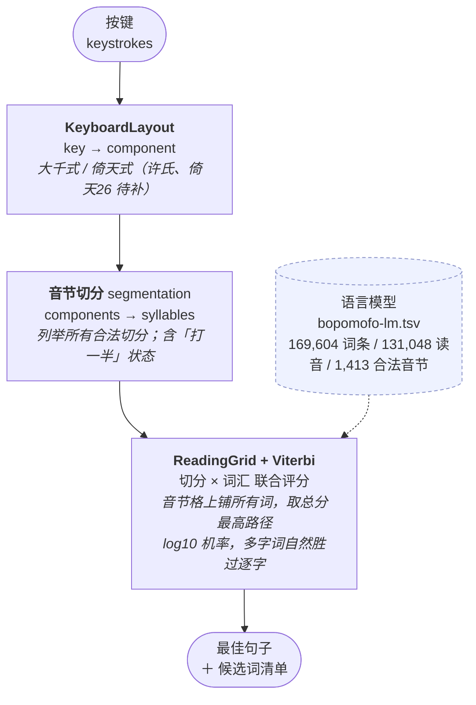

# 平注 PingZhu

**简体中文** ｜ [English](README.en.md)

**开放原始码、跨平台的注音输入法引擎 —— 目标是成为「自然输入法」的平替。**

Windows · macOS · Android · HarmonyOS NEXT · Linux

[](https://github.com/173787247/pingzhu/releases)
[](#现况)
[](LICENSE)
[](NOTICE)

---

## 这是什么

平注（PingZhu）是一套从零打造的注音（Bopomofo／Zhuyin）输入法。它不做「又一个 RIME 设定档」，
而是把注音解码引擎本身做成可携核心，再为每个平台接上该平台的官方输入法框架：

| 平台 | 官方框架 | 引擎 | 外壳状态 |
|---|---|---|---|
| **Windows 10/11** | **TSF 文字服务（进语言列）** | ✅ C ABI | ✅ **可用**（[windows/](windows/README.md)） |
| Windows 10/11 | 可携版（托盘 + 全域钩子 + 注入） | ✅ C ABI | ✅ 可用（不需管理员权限） |
| macOS 12+ | InputMethodKit (IMK) | ✅ C ABI | 待做（走 Developer ID + 公证，非 App Store） |
| **Android 8+** | **`InputMethodService`** | ✅ C ABI（JNI） | ✅ **可用**（[android/](android/README.md)） |
| HarmonyOS NEXT | IME Kit / `InputMethodExtensionAbility` | ✅ C ABI（NAPI） | **技术已确认可行**，商业流程待查证（见 [docs/03](docs/03-platform-matrix.md)） |
| Linux | fcitx5 / ibus addon | ✅ C ABI | 选配 |

### 下载

| 平台 | 档案 |
|---|---|
| **Windows 10/11** | **[⬇ 安装包 pingzhu-0.7.6-setup.exe](https://github.com/173787247/pingzhu/releases/download/v0.8.0/pingzhu-0.7.6-setup.exe)**　·　[可携版 ZIP](https://github.com/173787247/pingzhu/releases/download/v0.8.0/pingzhu-0.7.6-win-x64.zip) |
| **Android 8+** | **[⬇ pingzhu-0.8.0-android.apk](https://github.com/173787247/pingzhu/releases/download/v0.8.0/pingzhu-0.8.0-android.apk)** |

**Windows**：装到 `%LOCALAPPDATA%\Programs\PingZhu`，不需要管理员权限。装好后 `Ctrl+Alt+Z`
切换中英、`Ctrl+Alt+S` 切换繁简（或用右下角的浮动按钮），打 `su3cl3` 会出现「你好」。
详细操作见 [windows/README.md](windows/README.md)。

**Android**：安装后到「设定 → 系统 → 语言与输入 → 虚拟键盘」启用，再选为输入法。
不需要任何权限。详细操作见 [android/README.md](android/README.md)。

## 现况

**M0 – M4c 与 M6 完成 —— Windows 与 Android 都可实际使用。**

解码引擎、资料管线、个人化学习、Rust 核心 ＋ C ABI，以及三个外壳：Windows TSF
（进语言列）、Windows 可携版、Android `InputMethodService`。

**三个外壳共用同一个 Rust 核心**——所以同一串按键在 Windows 和 Android 上得到同样的词。
这不是设计意图，是被 1,529 例差异化测试钉住的事实。

Windows 有两个外壳，共用同一份引擎与同一个候选视窗：

- **TSF 文字服务**（`pingzhu-tsf-*.dll`）——进语言列，`Win+Space` 可切换，对管理员视窗也可用。
  注册需要管理员权限（COM 伺服器与 CTF 语言设定档都在 HKLM）。
- **可携版**（`pingzhu-ime.exe`）——托盘常驻 + 全域键盘钩子 + `SendInput` 注入。
  不需要安装、不需要管理员权限、不写登录档，代价是不进语言列、对管理员视窗无效（UIPI）。

两个外壳都支援**繁简输出切换**（`pingzhu.ini`），内部一律以繁体解码，只在输出边界转换。

| | TypeScript 参考实作 | Rust 核心 |
|---|---|---|
| 测试 | 49 项 | 24 项（含 **1,529 例差异化测试**、152 例互动场景） |
| 每按键 | 15.2 µs | 16.5 µs |
| C ABI | — | ✅ 纯 C 程式可直接驱动（见 [core-rs](core-rs/README.md)） |

```console
$ node engine/cli.ts su3cl3 ji394su3 w96j0

> su3cl3
  keys      su3cl3
  注音      ㄋㄧˇ ㄏㄠˇ
  → 中文    你好   (score -5.09)
  候選      1.好  2.郝  3.㚼  4.㝀  5.🆗  6.👌 …

> ji394su3
  注音      ㄨㄛˇ ㄞˋ ㄋㄧˇ
  → 中文    我愛你   (score -5.40)
```

`ji394su3` 这一串刻意选得很刁钻：那八个按键可以合法切成 `ㄨㄛˇ-ㄞˋ-ㄋㄧˇ`（我爱你），
也可以切成 `ㄨㄛˇ-ㄋㄞˋ-ㄧˇ`（我奈以）。光看键盘顺序无法分辨，只有语言模型能选对。
这就是为什么本专案一开始就把「音节切分」和「词汇选择」放在同一次解码里评分，而不是拆成两段各自最佳化。

---

## 为什么要做这个

### 0. 注音略省力——但比直觉小，而且是量出来的

同一个语言模型、同一批 139,163 条多音节词、只换编码方式（词频加权）：

| | 注音 | 拼音 |
|---|---|---|
| **有效按键／字**（组字＋选字） | **2.95** | 3.07 |
| 首选正确率 | **97.98%** | 87.58% |
| 平均同码候选数 | **1.23** | 2.28 |

**注音少 3.8% 的按键（含单字的全集上少 5.0%）。**

「拼音要拼一串英文字母一定更长」**只对了一半**：

- 拼音在 `zh ch sh ang eng ong` 上要拼 2–5 个字母，注音各只要一键
- 但注音**几乎每个音节都要多打一个声调键**，拼音一个都不打

而最常用的词偏偏多半是简单音节，那里**拼音反而更短**：

```
我們  ㄨㄛˇ-ㄇㄣˊ  6 鍵 / women  5 字母   拼音短
可以  ㄎㄜˇ-ㄧˇ     5 鍵 / keyi   4 字母   拼音短
什麼  ㄕㄜˊ-ㄇㄛ˙   6 鍵 / shemo  5 字母   拼音短
台灣  ㄊㄞˊ-ㄨㄢ    5 鍵 / taiwan 6 字母   注音短
這樣  ㄓㄜˋ-ㄧㄤˋ   6 鍵 / zheyang 7 字母  注音短
```

全部 74,461 个两字词里，注音较短 39.5%、拼音较短 30.4%、相同 30.1%。

**所以优势不在拼字，在选字**：拼音丢掉声调后，`shi` 要同时代表 是、时、事、市、世、
式⋯⋯，而且会跨音节碰撞（`xian` 同时是「先」和「西+安」），平均同码候选数是注音的
2.7 倍。

> **诚实的说法**：注音略省，省在选字上多过省在拼字上。3.8–5% 是**上界**——我用
> 「同按键序列内词频最高者」估计拼音首选率，比真实拼音 IME 悲观（它们有更大的模型与
> 上下文）。真实差距很可能更小。

方法、限制与完整数字见 **[docs/09](docs/09-zhuyin-vs-pinyin.md)**，一行指令可重现：

```bash
node tools/zhuyin-vs-pinyin.mjs
```

（这个测量有自我验证：范围二的注音首选正确率 90.67%，与 `bench.mjs` 用完全不同路径
实测的 90.38% 相差 0.29 个百分点。）

### 1. 自然输入法没有行动版，而且官方写得很清楚

自然输入法（网际智慧 IQ Technology；1990 年由中央研究院许闻廉博士以「国音输入法」起家，
是台湾唯一仍在维护的付费商业注音输入法）是目前台湾最成熟的注音输入法。
但它的平台覆盖在 2026 年仍然只有两个桌面系统：

- Windows 专业版 `V13.1.1.35084`（2026/09/08），Windows 11／10 1903+，支援 Windows on Arm
- macOS 版 `V13.2.1`（2026/09/08），macOS Catalina 10.15+，**官网明写「不支援 iOS、iPadOS」**

官方客服中心甚至直接以「不支援」为标题发布条目：

- 【不支援】自然输入法是否能在 iPad、iPhone 上使用？
- 【不支援】自然输入法有 Linux 版吗？
- 【不支援】如何在 WIN10 平板上使用自然输入法？

也就是说，**Android、iOS、Linux、HarmonyOS 全部是空的**。而且这不是「没人做过」——
Google 注音输入法与 IQQI 智能输入法都曾在台湾行动市场存在，如今都已从 App Store 消失。
台湾使用者手机上打注音，至今仍只能将就内建键盘或 Gboard。

### 2. 授权模式制造了大量摩擦

官方零售价（2026 年，iqt.ai 价格页）：

| 方案 | 价格 |
|---|---|
| V13 专业版 买断 1 人 2 台 | NT$2,800 |
| V13 专业版 买断 1 人 3 台 | NT$3,900 |
| 订阅 月缴 / 季缴 | NT$129 / NT$329 |
| 订阅 年缴 2 台 / 3 台 / 4 台 | NT$899 / NT$1,299 / NT$1,649 |
| 追音版（2 台 Windows） | NT$3,500 |

买断版「限购买当时的版本」，官方说明一年后若系统环境更新可能出现相容问题，「您就需要购买本公司新版软体」。
免费 Lite 版则必须注册帐号、不支援 Mac、不支援离线、只有标准注音键盘、无技术客服，
且公告 2026/10/15 起旧版本将无法登入订阅帐号（强制升级）。

这些摩擦直接反映在客服中心的内容分布上：**绝大多数条目都是授权到期、授权已满、换电脑、
移除装置、扣款失败、登入失败、取消订阅**——而不是「怎么打字」。

### 3. 开源生态有零件，但没有成品

注音引擎的零件其实不缺，缺的是把它们组合成一个四平台产品的人（详见
[docs/04-data-and-licensing.md](docs/04-data-and-licensing.md)）：

- **libchewing**（新酷音）核心已重写为 **Rust**、附 C API 与官方 Swift Package，授权 LGPL-2.1
- **McBopomofo**（小麦注音）是 **MIT**，引擎与 13 万条注音词库全部开放，但**与 macOS 深度耦合**，没有可携核心
- **RIME／librime** 是 BSD-3，但它的「注音」是把拼音词库用拼写代数转写而成，且官方各平台前端全是 GPL-3.0
- 纯 Android 的注音键盘（如朴实注音）多为 GPL-3.0 且功能单薄

平注的定位就是那个缺掉的成品：**宽松授权的可携核心 ＋ 四个平台的原生外壳**。

---

## 快速开始

需要 Node.js ≥ 22.6（用到内建 TypeScript 型别剥离，不需要编译步骤、零依赖）。

```bash
git clone <this-repo> && cd pingzhu

# 互動模式：直接敲注音按鍵，即時看解碼結果
node engine/cli.ts

# 非互動：直接解一串按鍵
node engine/cli.ts su3cl3 ji394su3 w96j0
node engine/cli.ts --layout eten ne3     # 倚天鍵盤

# 測試與評測
cd engine && node --test                      # 66 項
node engine/bench.mjs 5000                  # 解碼品質
node engine/bench.mjs 5000 --compare        # promotion 開啟前後的逐例對比
node engine/bench-learn.mjs 5000            # 學習前後對比
node engine/bench-learn.mjs 5000 --recall   # 候選可達性
```

| 按键 | 输出 | 说明 |
|---|---|---|
| `su3cl3` | 你好 | ㄋㄧˇ ㄏㄠˇ |
| `ji394su3` | 我爱你 | ㄨㄛˇ ㄞˋ ㄋㄧˇ（歧义切分） |
| `w96j0` | 台湾 | ㄊㄞˊ ㄨㄢ（第二音节省略声调键） |
| `rupwu0` | 今天 | ㄐㄧㄣ ㄊㄧㄢ（一声不打调号） |
| `g4` | 是 | ㄕˋ（单独成音的ㄕ） |
| `j0420` | 万丹 | ㄨㄢˋ ㄉㄢ（声调不会跑到下一个音节） |

互动模式下：`空白鍵` 送出组字、`↓` 开启候选、开启后 `1`-`9`/`0` 选字、`空白鍵` 翻下一页十个、
`←`/`→` 移动候选游标。

---

## 当成函式库使用

引擎可以独立使用，零执行期依赖：

**方式一：从 release 上的 tarball 装**（零帐号、零设定，**推荐**）

```bash
npm install https://github.com/173787247/pingzhu/releases/download/v0.8.0/pingzhu-engine-0.8.0.tgz
```

**方式二：从 GitHub Packages 装**（要先配 GitHub token ✗）

```bash
npm install @173787247/pingzhu-engine
```

> GitHub Packages **连安装公开套件都要求认证**——这不是猜测，是在这个套件上实测的：
> `npm error 401 Unauthorized - authentication token not provided`
>
> 要用的话先配一次：`echo "//npm.pkg.github.com/:_authToken=$(gh auth token)" >> ~/.npmrc`

```js
import { InputEngine, LAYOUTS } from "@173787247/pingzhu-engine";
import { loadDictionary, loadSyllableInventory, loadConverter } from "@173787247/pingzhu-engine/node";
```

主入口**不 import 任何 Node 内建模组**，所以浏览器与打包器都能用 ✓；
档案系统相关的工具在 `/node` 子路径 ✓。这个分割由测试钉住，不是靠注解。

## 架构



这个分层不是为了好看，而是为了**平台外壳可以极薄**：TSF、IMK、`InputMethodService`、
`InputMethodExtensionAbility` 四者要的都只是「给我一串按键，还我一段文字＋候选清单」，
所以核心完全不碰 UI、不碰视窗、不碰平台 API。

实测效能（Node 24，单执行绪，载入 6.4 MB 语言模型）：

| 指标 | 数值 |
|---|---|
| 模型载入 | 273 ms（一次性） |
| 每按键解码 | **15.2 µs** |
| 吞吐 | 65,934 键/秒 |

输入法可接受的候选字延迟是 10 ms 等级，这里差了三个数量级——**延迟不是这个专案的风险**。

### 解码品质（可重跑）

```console
$ node engine/bench.mjs 5000

  top-1 accuracy    90.38%   (4519/5000)  exact word match
  reading accuracy  100.00%   (5000/5000)  output reads as typed
    homophone ties        480   (another real word, same reading)
    lost to decomposition   1   (a word existed and lost to single characters)
  KSPC              2.986 keys per character
```

**没选对的 481 例，480 例是同音词**：`畜牲`/`畜生`、`申飭`/`申斥` 读音完全相同，
任何注音解码器在没有上下文时都无法分辨。5,000 个样本里**没有任何一次真正的解码失败**
——输出永远读得回你打的音。

### 个人化：教一次就记住（可重跑）

```console
$ node engine/bench-learn.mjs 5000

                              before      after
  top-1 accuracy              90.38%      99.54%
  homophone ties                480          21
  fixed by learning         464    regressed 6 (5 例是测试集碰撞，1 例已知副作用)
```

同音词的答案不是「让模型更聪明」，而是**让使用者自己选，并且记住**：

| 操作 | 行为 |
|---|---|
| `1`…`9`、`0` | 选目前页面的第 1…10 个候选 |
| `空白鍵` | 送出（候选视窗关闭时）；翻到下一页（开启时） |
| `←` `→` | 沿组字缓冲区移动候选游标 |

引擎选错时，正确的字有 **99.8%** 落在第一页——所以更正的成本是一个按键。

> ⚠️ 样本取自语言模型本身，因此这是**自我一致性**（上界）与**回归守门**，不是与竞品的对比数字。
> 真正的对比需要真实使用者的打字语料，目前不存在。详见 [docs/06](docs/06-engine-design.md)。

---

## 专案状态

| 里程碑 | 内容 | 状态 |
|---|---|---|
| **M0** | 解码引擎：键盘／切分／读字格 Viterbi／候选视窗 | ✅ 已完成 |
| **M1** | 资料管线：从 McBopomofo 开放资料编译出可携语言模型 | ✅ 已完成 |
| **M2** | 个人化：使用者词库、学习排序、候选翻页 | ✅ 已完成 |
| **M3** | Rust 核心 ＋ C ABI（差异化测试对 TS 参考实作） | ✅ 已完成 |
| **M4a** | Windows 可携版外壳（托盘／钩子／候选视窗／注入） | ✅ 已完成 |
| **M4b** | Windows TSF 外壳：进语言列、组字、显示属性、候选视窗定位、安装程式 | ✅ 已完成 |
| **M4c** | 繁简输出：OpenCC 对照表、热键／浮动按钮／设定档三种切换方式 | ✅ 已完成 |
| **M5** | macOS IMK 外壳 | 待做 |
| **M6** | Android `InputMethodService` 外壳：自绘键盘、候选列、JNI | ✅ 已完成 |
| **M7** | HarmonyOS IME Kit 外壳 | 研究中 |
| **M8** | 其他加值功能：符号表、联想词、快捷输入 | 待做 |

测试现况：**TypeScript 66 项**、**Rust 26 项**（含 1,529 例差异化测试）、
**Windows 原生 3 组**（按键路由／引擎整合／TSF COM 契约）、
**Android JVM 12 项**（按键路由，不需要模拟器）。

详细排程、工作量与风险见 [docs/05-roadmap.md](docs/05-roadmap.md)。

---

## 文件

| 文件 | 内容 |
|---|---|
| [docs/01](docs/01-competitive-analysis.md) | 自然输入法产品拆解：35 年版本史、功能清单、定价、平台矩阵、技术架构、使用者痛点 |
| [docs/02](docs/02-architecture.md) | 架构决策：为何宽松授权核心、为何四平台原生壳、为何不用 Flutter |
| [docs/03](docs/03-platform-matrix.md) | 四平台输入法框架能力、签章与上架限制、HarmonyOS 可行性 |
| [docs/04](docs/04-data-and-licensing.md) | 每一个可用元件的授权、资料来源合规、地雷清单 |
| [docs/05](docs/05-roadmap.md) | MVP → v1 的路线、工作量估算、风险与退路 |
| [docs/06](docs/06-engine-design.md) | 引擎内部：切分演算法、读字格、资料格式、评测方法 |
| [docs/07](docs/07-research-tooling.md) | 本仓库的调研工具链（可重现取证） |
| [docs/08](docs/08-self-built-data.md) | **资料层可以自建**：Unihan 读音／简繁、词频公式、无监督新词发现 |
| [docs/09](docs/09-zhuyin-vs-pinyin.md) | **注音 vs 拼音的量化论证**：方法、两种范围、自我验证、五条明确的限制 |
| [core-rs/](core-rs/README.md) | **Rust 核心 ＋ C ABI**：外壳怎么接、怎么验证 |
| [windows/](windows/README.md) | **Windows 输入法**：操作、建置、限制 |
| [android/](android/README.md) | **Android 输入法**：建置、设计取舍、已知限制 |
| [research/01](research/01-iqt-natural-ime.md) · [02](research/02-opensource-stack.md) · [03](research/03-platform-ime-frameworks.md) · [04](research/04-zhuyin-ime-internals.md) | 四份原始调研报告（约 34 万字，含逐条来源与【已查证】/【推测】/【需查证】三级标记） |

---

## 授权与致谢

**整包 MIT**——程式码与资料同一个授权，见 [LICENSE](LICENSE)。

- **程式码**：MIT
- **语言模型资料**：衍生自 **McBopomofo**（MIT，Copyright © 2022 and onwards The McBopomofo Authors），
  其词库 `BPMFMappings.txt` 又衍生自 libtabe 的 `tsi.src`（BSD）

选 MIT 而非 Apache-2.0 的理由：本专案零程式码依赖，且资料本身即衍生自 MIT 来源，
单一授权让整条授权链一致；MIT 同时与 GPL-2.0-only 相容，而 Apache-2.0 不相容
（见 [docs/02](docs/02-architecture.md) 决策 6）。授权链与逐项声明见 [NOTICE](NOTICE)。

平注与网际智慧股份有限公司（IQ Technology Inc.）无任何关联；「自然输入法」为其商标，
本专案仅在评论与相容性描述中提及该产品名称。

---

## English

A full English README is at **[README.en.md](README.en.md)**.

**PingZhu** is an open-source, cross-platform Bopomofo (注音 / Zhuyin) input method for
Windows, Android, macOS, HarmonyOS NEXT and Linux. It exists because the dominant
commercial Taiwanese IME, 自然输入法 (IQ Technology, in the market since 1995), ships only
on Windows and macOS — its own support centre publishes articles titled "not supported"
for iPad/iPhone, Linux and Android tablets — while its licensing model generates a support
burden made overwhelmingly of activation and subscription failures rather than typing
questions.

**Windows and Android builds are usable today.** All three shells embed the same Rust
core, held to byte-identical output against the TypeScript reference implementation by
1,529 differential cases, so the same keys give the same words everywhere.

| | |
|---|---|
| License | MIT |
| Runtime dependencies | none (engine, Rust core, and both shells) |
| Language model | 169,604 entries over 131,048 readings, from McBopomofo (MIT) ← libtabe `tsi.src` (BSD) |
| Simplified output | OpenCC table (Apache-2.0), applied at the output boundary |
